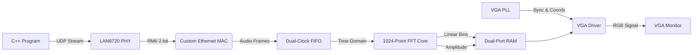

<div align="center">

# FPGA Audio Visualizer


**A 32-band audio frequency visualiser built on an FPGA. It receives audio over Ethernet, processes it using a 1024-point FFT, and logarithmically maps the frequencies to a VGA display.**

https://github.com/user-attachments/assets/8b688af6-d99d-4f4f-9ccb-69480a7465fb

</div>

## Overview

This project is a complete hardware and software pipeline for visualising audio. A custom C++ program reads WAV files and streams the raw audio data over a dedicated Ethernet link. 

The Intel Cyclone IV FPGA catches this stream using an Ethernet receiver built from scratch. It then runs the audio through a hardware Fast Fourier Transform (FFT) to break it down into frequency bins. Instead of just displaying these bins linearly, the FPGA maps them to the screen in octaves, matching human hearing, before sending the final image to a 60Hz monitor.

## System Architecture

The setup relies on the C++ program acting as a highly precise audio transmitter, while the FPGA acts as a real-time hardware receiver and audio processor.



## Features

* Custom SystemVerilog Ethernet parser that decodes physical RMII signals, extracts IPv4/UDP payloads, and drops invalid packets using real-time checksum verification.
* C++ driver that bypasses OS timing drift, maintaining perfect synchronization with the audio track.
* An exponential mathematical Look-Up Table (LUT) that maps the 512 linear FFT bins to 32 visual bands based on human octave perception: $b(x) = B_{min} \cdot (B_{max}/B_{min})^{x/(N-1)}$.
* A custom max-pooling circuit that tracks the highest peak, ensuring sharp percussion like hi-hats still make the visualiser react violently.

## Hardware Implementation

The project runs on the Intel Cyclone IV EP4CE6E22C8N FPGA using the RZ-EasyFPGA A2.2 development board. The physical layer interface is provided by a generic LAN8720 Module. A USB-C to Ethernet adapter is used to create a dedicated local network link between the host PC and the FPGA. Output is sent to a monitor via a standard VGA-to-HDMI adapter.

* FPGA: [Intel Cyclone IV EP4CE6E22C8N](https://www.intel.com/content/www/us/en/products/sku/210472/cyclone-iv-ep4ce6-fpga/specifications.html)
* FPGA Development Board: [RZ-EasyFPGA A2.2 / RZ-EP4CE6-WX board](https://web.archive.org/web/20210128152708/http://rzrd.net/product/?79_502.html)
* Ethernet PHY: [LAN8720 PHY Module](https://www.ebay.com.au/itm/233326770234)
* Ethernet Adaptor: [ALOGIC Ultra Mini USB-C to Ethernet Adapter](https://www.jbhifi.com.au/products/alogic-ultra-mini-usb-c-to-ethernet-adapter)
* VGA-to-HDMI Adapter: [eBay Listing](https://www.ebay.com.au/itm/302905294205)

### Pinout Configuration

| Signal Name | FPGA Pin | Description |
| :--- | :--- | :--- |
| `board_clk` | **PIN_23** | 50MHz Board Clock |
| `resetn` | **PIN_25** | System Reset (Active Low) |
| `phy_clk` | **PIN_88** | 50MHz PHY Reference Clock |
| `rx0` | **PIN_76** | RMII Data Bit 0 |
| `rx1` | **PIN_77** | RMII Data Bit 1 |
| `data_valid` | **PIN_83** | RMII Carrier Sense / Data Valid |
| `tx_en` | **PIN_74** | RMII Transmit Enable |
| `red` | **PIN_106** | VGA Red Channel (1-bit) |
| `green` | **PIN_105** | VGA Green Channel (1-bit) |
| `blue` | **PIN_104** | VGA Blue Channel (1-bit) |
| `h_sync` | **PIN_101** | VGA Horizontal Sync |
| `v_sync` | **PIN_103** | VGA Vertical Sync |

## Software Implementation

The audio transmitter is a C++ GUI application. Because the custom FPGA logic only listens for data and doesn't handle full two-way software handshakes (like ARP replies), you have to tell Windows exactly where to send the packets. 

This can be done by running a command in an Admin terminal to link the FPGA's IP address to its physical MAC address:

```cmd
netsh interface ip add neighbors "Ethernet Interface Name" 192.0.2.146 00-1A-2B-3C-4D-5E
```

## Project Directory
```text
├── quartus/               # Quartus Prime project files and QSF constraints
├── audio/                 # Example .wav files to use with the visualiser
├── rtl/
│   ├── core/              # Project-specific logic (Top level, memory writers, VGA driver)
│   ├── eth/               # Custom RMII Ethernet MAC and UDP Parser
│   ├── fft/               # Quartus 1024-Point Audio FFT IP
│   ├── fifo/              # Dual-Clock FIFO IP
│   ├── ram/               # Dual-Port RAM IP
│   └── vga/               # VGA sync generators and 25.175MHz PLL
├── tb/                    # Questa testbenches and Signal Tap setup files
└── software/
    └── main.cpp           # C++ Transmitter GUI
```
